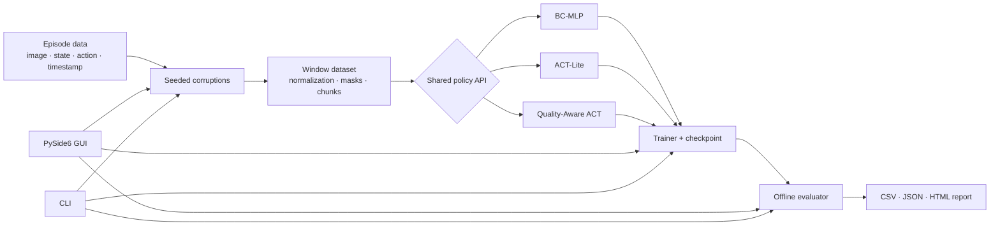

# Sync2Act

**A PyTorch + native desktop lab for measuring how robot demonstration quality changes imitation-learning behavior.**

Sync2Act turns a clean, episode-based robot dataset into controlled, reproducible experiments: corrupt the observations or actions, train one of three policies, measure offline behavior, compare trajectories, and export an evidence-bearing report. It ships with deterministic synthetic demonstrations, so the complete workflow works on CPU without a simulator or a download.

## Try it in three commands

```bash
python -m pip install -e .[dev]
sync2act demo
sync2act-gui
```

Python 3.11–3.13 is supported. The default demo uses CPU, trains a tiny BC-MLP, writes a checkpoint and per-episode predictions, evaluates it offline, and creates `runs/demo/report.html`.

## What is implemented

| Policy | Prediction | Purpose |
|---|---|---|
| BC-MLP | `state[t]` or `image[t] + state[t] → action[t]` | Fast baseline and pipeline debugging |
| ACT-Lite | `image[t] + state[t] → action[t:t+H]` | Learnable action queries, positional encoding, Transformer, padding-aware chunk loss, receding-horizon temporal ensemble |
| Quality-Aware ACT | ACT-Lite plus quality token and weighted loss | Tests whether quality metadata reduces sensitivity to damaged demonstrations |

ACT-Lite is **not** a full reproduction of ACT: it intentionally omits the original CVAE latent-variable path. Quality-Aware ACT subclasses and reuses ACT-Lite rather than maintaining a copied model.

Data quality matters because behavior cloning assumes observations and labels describe the same moment and valid sensor state. A shifted image, repeated frame, delayed action, or stuck joint can turn a valid demonstration into a contradictory training target. Sync2Act records exactly what changed and makes that assumption testable.

## Desktop application

Launch with `sync2act-gui` or `python -m sync2act.gui`. The PySide6 window starts with no dataset loaded, preventing accidental training on demonstration data, and provides:

- **Overview:** empty-until-imported episode/frame/shape/device summary, background Hugging Face downloads, and local LeRobot v3 loading with target-folder selection and progress.
- **Dataset Inspector:** RGB preview, episode/step totals, one shared state/action dimension selector, a separate quality plot, time-labelled axes, selected-step cursors, and original-versus-working-copy comparison.
- **Corruption Studio:** type-aware target controls, deterministic-seed disabling, a live three-stream alignment diagram for temporal shifts, a dropped-frame timeline, and before/after action or state curves with exact frame-level original/new/delta values.
- **Corruption Studio:** seeded shift, drop, noise, and anomaly controls with live provenance preview, Apply, Reset, and YAML export.
- **Training Monitor:** BC-MLP, ACT-Lite, or Quality-Aware ACT in a `QThread`; editable device, epoch, batch, optimizer, split, loss, seed, and gradient-clipping settings; recommended-value hints; live loss/LR/ETA; safe stop, checkpoint, and resume.
- **Evaluation & Compare:** offline metrics, checkpoint loading, and target/prediction trajectories. Rollout fields are visibly `not run`.
- **Report:** HTML and JSON export containing configuration, seeds, dependency versions, timestamp, and Git commit when available.

The optional local Windows bundle can be rebuilt with:

```bash
python -m pip install pyinstaller
python -m PyInstaller --noconfirm Sync2Act.spec
dist\Sync2Act\Sync2Act.exe
```

## Architecture



The GUI and CLI call the same functions in `pipeline.py`, `training/`, `evaluation/`, and `reporting/`; there is no second training implementation hidden in the interface.

## Reproducible experiments

```bash
# Save a deterministically corrupted demo dataset
sync2act corrupt --config configs/corruption/shift_2.yaml

# Train and evaluate
sync2act train --config configs/train/act_lite.yaml --output runs/act-lite
sync2act evaluate --config configs/eval/default.yaml \
  --checkpoint runs/act-lite/checkpoint.pt --output runs/act-lite/eval

# Full 3-model × 10-condition × 3-seed matrix (CPU-intensive)
sync2act benchmark --config configs/benchmark/mvp.yaml

# Rebuild a report from completed run manifests only
sync2act report --runs runs/ --output reports/benchmark.html
```

Training-data corruption is represented by a `corruption` block in a training config: damaged demonstrations are used for learning and clean episodes for evaluation. Runtime observation corruption belongs in an environment/rollout adapter and is reported separately; it is not silently approximated by offline loss.

The desktop workflow performs a deterministic episode-level train/validation/test split before applying damage. Corruption Studio changes training episodes only; validation and test episodes remain clean. Validation uses normalization statistics computed from the training partition, and Evaluation Compare runs only on the held-out clean test episodes. The split indices and ratios are saved with checkpoints and reports.

Every corruption clones its input, accepts a seed, updates `quality_score` and/or `missing_mask`, and attaches provenance with type, parameters, seed, and affected indices. Supported variants are:

- temporal shift of image/state/action with `drop`, `repeat`, `zero`, or `mask` boundaries;
- frame drop with previous-frame, zero-frame, or interpolation replacement;
- Gaussian/spike action noise and fixed/random action delay;
- state spike, short missing span, stuck dimension, and timestamp jitter.

## Results: measured versus pending

The bundled smoke experiment is deliberately tiny and is a pipeline check, not a benchmark. The following values came from an actual CPU run on 2026-09-02 with the committed demo configuration:

| Run | Scope | Steps | Action MSE | Action MAE | Parameters | Training time |
|---|---|---:|---:|---:|---:|---:|
| bundled BC-MLP demo, seed 7 | offline-only | 6 | 0.246560 | 0.400231 | 17,859 | 0.061 s |
| ACT-Lite formal matrix | not run | not run | not run | not run | not run | not run |
| Quality-Aware ACT, 10% frame-drop smoke | offline-only | 55 | 0.277829 | 0.426424 | 245,091 | not persisted |
| Quality-Aware ACT formal matrix | not run | not run | not run | not run | not run | not run |
| Closed-loop PushT/robot rollout | not run | not run | not run | not run | not run | not run |

Latency from that same small run was P50 `0.0149 ms/sample` and P95 `0.0254 ms/sample`; treat these as environment-specific smoke measurements. No success rate, return, video, or formal robustness claim is inferred from them.

## Bring your own data

The Overview tab can download a public or locally authenticated private Hugging Face dataset repository into any selected folder. Progress is reported by completed files, and Hugging Face's local metadata allows interrupted/repeated downloads to reuse completed files. For a LeRobot v3 repository, select its root folder and click **Load local dataset**. Sync2Act reads the metadata and parquet rows, decodes the selected RGB video feature, splits frames by `episode_index`, initializes clean quality metadata, and derives the model state/action dimensions automatically.

Convert each episode to the public dictionary contract below and pass a list of episodes to `EpisodeWindowDataset` or the training functions:

```python
{
    "observation.image": Tensor[T, 3, H, W],
    "observation.state": Tensor[T, state_dim],
    "action": Tensor[T, action_dim],
    "timestamp": Tensor[T],
    "quality_score": Tensor[T],
    "missing_mask": Tensor[T],
}
```

`sync2act.data.lerobot.LeRobotEpisodeAdapter` is the optional integration boundary. Install with `pip install -e .[lerobot]`; version-specific LeRobot code stays out of the core data and model modules. The adapter currently establishes the dependency boundary and repository loader; dataset-field conversion should be added for the exact LeRobot schema you use.

## Development and verification

```bash
python -m ruff check src tests tools
pytest
```

Tests cover corruption shape/reproducibility/non-mutation/provenance, model shapes, weighted-loss edge cases, temporal ensembling, checkpoint equivalence and resume, BC/ACT training, end-to-end artifacts, and GUI event-loop behavior. GUI tests use `QT_QPA_PLATFORM=offscreen` and `SYNC2ACT_RUN_GUI_TESTS=1` in GitHub Actions; locally they skip when no Qt-capable session is exposed.

The formal benchmark is intentionally not run during installation. It is a 90-run CPU workload by default and must never be replaced with invented values. Optional next work is a concrete LeRobot field converter followed by a Gymnasium/PushT runtime-corruption wrapper and closed-loop success evaluation.

## Repository map

```text
src/sync2act/data/          episode contract, synthetic data, windows, LeRobot boundary
src/sync2act/corruptions/   deterministic damage operators and provenance
src/sync2act/policies/      BC-MLP, ACT-Lite, Quality-Aware ACT
src/sync2act/training/      loss, loop, safe checkpoint and resume
src/sync2act/evaluation/    offline metrics and temporal ensembling
src/sync2act/reporting/     HTML/JSON evidence report
src/sync2act/gui/           native PySide6 application and worker
src/sync2act/cli.py         automation entrypoint
configs/                    corruption, train, eval, benchmark YAML
tests/                      unit, integration, GUI
```

MIT licensed. Large datasets, checkpoints, generated runs, and reports are ignored by Git.
