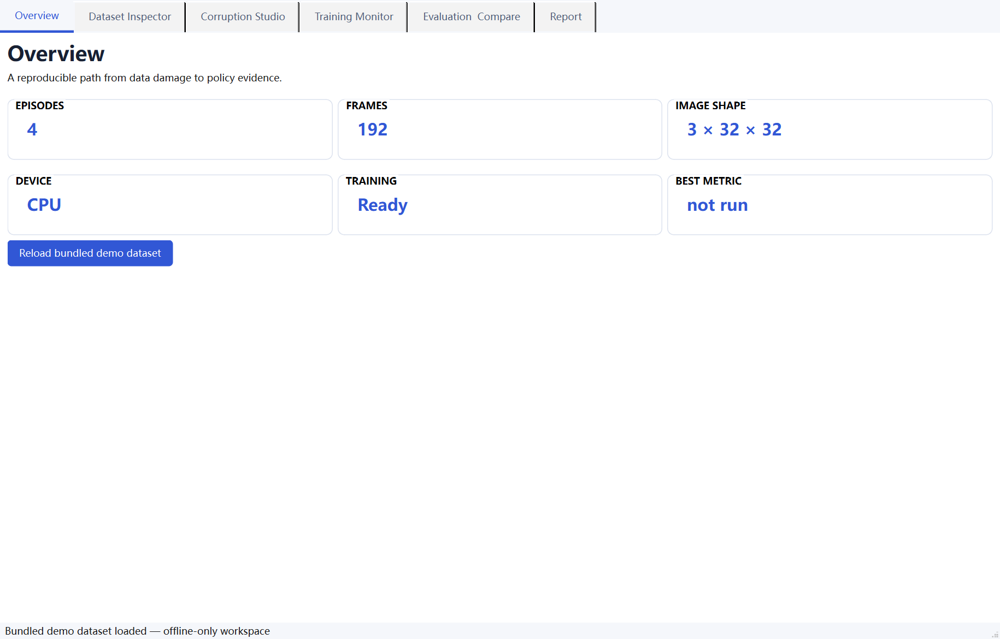
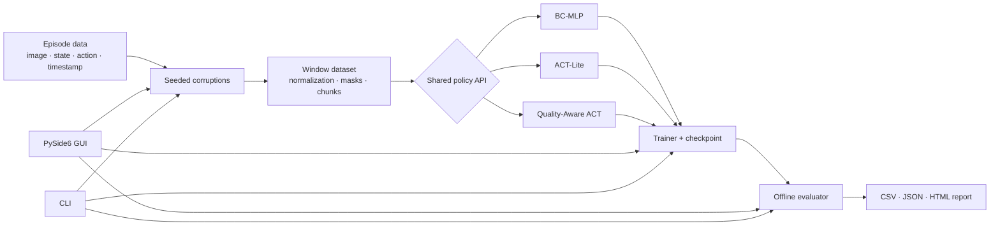

# Sync2Act

[](https://github.com/33Geniusss/Sync2Act/actions/workflows/ci.yml)
[](https://www.python.org/)
[](LICENSE)

**A PyTorch + native desktop lab for measuring how robot demonstration quality changes imitation-learning behavior.**

Sync2Act turns an episode-based robot dataset into controlled, reproducible experiments: import data, damage selected training episodes, train imitation-learning policies and quality ablations, compare offline predictions, and export an evidence-bearing report. The desktop application starts empty and does not bundle a dataset, trained checkpoint, or benchmark result.



## Research workflow

```text
Original episodes
├─ Training episodes   → clean or deliberately corrupted
├─ Validation episodes → always clean
└─ Test episodes       → always clean
```

The split is episode-level, preventing frames from one trajectory from leaking across partitions. Corruptions are applied only to the training partition. Formal corruption studies freeze normalization statistics computed from the clean training episodes and reuse them for every condition; model comparison uses held-out clean test episodes.

## Quick start from source

```bash
python -m pip install -e .[dev]
sync2act-gui
```

Python 3.11–3.13 is supported. Import or download a dataset from **Overview** before opening the training workflow. A deterministic synthetic-data command remains available for development and automated tests through `sync2act demo`, but it is not loaded by the GUI.

## What is implemented

| Policy | Prediction | Purpose |
|---|---|---|
| BC-MLP | `state[t]` or `image[t] + state[t] → action[t]` | Fast baseline and pipeline debugging |
| ACT-Lite | `image[t] + state[t] → action[t:t+H]` | Learnable action queries, positional encoding, Transformer, padding-aware chunk loss, receding-horizon temporal ensemble |
| Quality-Aware ACT | ACT-Lite plus per-camera/per-state quality conditioning and optional action-label weighted loss | Tests whether modality-specific quality metadata reduces sensitivity to damaged demonstrations |

ACT-Lite is **not** a full reproduction of ACT: it intentionally omits the original CVAE latent-variable path. Quality-Aware ACT subclasses and reuses ACT-Lite rather than maintaining a copied model.

All three policies are implemented in this repository and trained from scratch on the selected dataset; they are not fine-tuned third-party checkpoints.

Data quality matters because behavior cloning assumes observations and labels describe the same moment and valid sensor state. A shifted image, repeated frame, delayed action, or stuck joint can turn a valid demonstration into a contradictory training target. Sync2Act records exactly what changed and makes that assumption testable.

## Desktop application

Launch with `sync2act-gui` or `python -m sync2act.gui`. The PySide6 window starts with no dataset loaded, preventing accidental training on demonstration data, and provides:

- **Overview:** empty-until-imported episode/frame/shape/device summary, background Hugging Face downloads, and local LeRobot v3 loading with progress. Downloads default to `<user-home>/Sync2Act/datasets/<repository-name>` while still allowing a custom target. Hub transfer metadata is kept separately under `<user-home>/Sync2Act/.cache/huggingface`, so dataset folders contain only repository files and deeply nested camera paths do not inherit long temporary filenames.
- **Dataset Inspector:** RGB preview, episode/step totals, one shared state/action dimension selector, a separate quality plot, time-labelled axes, selected-step cursors, and original-versus-working-copy comparison.
- **Corruption Studio:** type-aware target controls, deterministic-seed disabling, a live three-stream alignment diagram for temporal shifts, a dropped-frame timeline, and before/after action or state curves with exact frame-level original/new/delta values.
- **Training Monitor:** BC-MLP, ACT-Lite, or Quality-Aware ACT in a background worker; editable device, epochs, batch size, learning rate, weight decay, validation split, loss, seed, and gradient clipping; recommended-value hints; estimated optimizer steps; live loss/LR/ETA; safe stop, checkpoint, and resume. New checkpoints are automatically named `<model>_<data-condition>_<timestamp>.pt` under `<application-folder>/models`.
- **Evaluation & Compare:** checkpoint loading, offline metrics, per-episode results, and target/prediction trajectories.
- **Report:** HTML and JSON export containing configuration, seeds, dependency versions, timestamp, and Git commit when available.

The Training Monitor estimates work before launch as:

```text
steps_per_epoch = ceil(training_frames / batch_size)
total_steps     = epochs × steps_per_epoch
```

Validation batches are not included in this optimizer-step estimate.

The optional local Windows bundle can be rebuilt with:

```bash
python -m pip install pyinstaller
python -m PyInstaller --noconfirm Sync2Act.spec
dist\Sync2Act\Sync2Act.exe
```

At runtime, the packaged CUDA build uses an available NVIDIA GPU when compatible CUDA drivers are present; otherwise the application reports CPU. Prebuilt archives, when published, belong on the repository's [Releases page](https://github.com/33Geniusss/Sync2Act/releases), not in Git history.

## Architecture



The GUI and CLI call the same functions in `pipeline.py`, `training/`, `evaluation/`, and `reporting/`; there is no second training implementation hidden in the interface.

## Reproducible experiments

```bash
# Save a deterministically corrupted demo dataset
sync2act corrupt --config configs/corruption/shift_2.yaml

# Train and evaluate
sync2act train --config configs/train/act_lite.yaml --output runs/act-lite
sync2act evaluate --config configs/eval/default.yaml \
  --checkpoint runs/act-lite/checkpoint.pt --output runs/act-lite/eval

# Small configurable benchmark
sync2act benchmark --config configs/benchmark/mvp.yaml

# Rebuild a report from completed run manifests only
sync2act report --runs runs/ --output reports/benchmark.html
```

Training-data corruption is represented by a `corruption` block in a training config: damaged demonstrations are used for learning and clean episodes for evaluation. Runtime observation corruption belongs in an environment/rollout adapter and is reported separately; it is not silently approximated by offline loss.

The desktop workflow performs a deterministic episode-level train/validation/test split before applying damage. Corruption Studio changes training episodes only; validation and test episodes remain clean. Validation uses normalization statistics computed from the training partition, and Evaluation Compare runs only on the held-out clean test episodes. The split indices and ratios are saved with checkpoints and reports.

Every corruption clones its input, accepts a seed, updates only the affected modality, and appends an event to `corruption_events` with type, parameters, seed, affected indices, and missing indices. Image metadata is per camera. `image_quality[T, cameras]` and `state_quality[T]` describe model inputs; `action_label_quality[T]` describes supervision reliability and is used only by the weighted training loss. Modality-specific time offsets and missing masks prevent unrelated faults from cancelling one another. Legacy scalar summaries remain available for display and backward compatibility.

Temporal quality is severity-aware: `q = exp(-abs(modality_time_offset) / (2 * median_frame_interval))`. A one-frame offset therefore has quality about `0.607`, while a three-frame offset has quality about `0.223`. Zero/mask boundary samples remain quality `0` because they have no valid source frame.

- temporal shift of image/state/action with `drop`, `repeat`, `zero`, or `mask` boundaries;
- frame drop with previous-frame, zero-frame, or interpolation replacement;
- Gaussian/spike action noise and fixed/random action delay;
- state spike, short missing span, stuck dimension, and timestamp jitter.

The focused quality study constructs deterministic, contiguous mixed-quality segments. Its six ablations are ACT-Lite, quality-input only, quality-weighted-loss only, full quality conditioning, shuffled-quality control, and constant-quality control. Run the full three-dataset, three-seed study with:

```bash
python tools/run_real_dataset_study.py --skip-download --device cuda \
  --episodes 0 --frames 0 --epochs 10 --seeds 7 17 27 \
  --act-batch-size 256 --segment-length 16 \
  --output runs/quality_ablation_v1_2_0
```

Each checkpoint is written atomically and records checkpoint/quality schema versions, model and configuration signatures, source version, Git commit, experiment signature, and the quality formula. Resume skips a run only when its manifest, checkpoint, model signature, experiment signature, and evaluation CSV files all agree.

## Offline evaluation

Evaluation is performed on held-out samples with ground-truth actions. Sync2Act reports `action_mse`, `action_mae`, trajectory smoothness, jerk, P50/P95 inference latency, parameter count, and per-episode metrics. Smoothness and jerk are calculated inside each episode and then aggregated, so the final frame of one episode is never connected to the first frame of another.

These are offline imitation metrics, not closed-loop robot success rates. The repository intentionally contains no precomputed benchmark results or trained models; reported numbers should come from the user's own dataset, split, seed, and hardware.

## Dataset download and storage

The Overview tab can download a public or locally authenticated private Hugging Face dataset repository. The target is selectable, download progress is shown, and the default paths are:

```text
C:\Users\<username>\Sync2Act\datasets\<repository-name>
C:\Users\<username>\Sync2Act\.cache\huggingface
```

The second directory contains resumable Hugging Face transfer metadata. It is deliberately separated from the dataset directory to avoid Windows path-length failures. Dataset folders, caches, checkpoints, generated runs, and release archives are excluded from Git.

## Local LeRobot datasets

For a LeRobot v3 repository, select its root folder and click **Load local dataset**. A typical supported layout contains:

```text
meta/info.json
data/chunk-*/file-*.parquet
videos/<image-feature>/chunk-*/*.mp4
```

The loader reads parquet rows, decodes every RGB video feature, aligns all camera views by frame, splits frames by `episode_index`, initializes clean quality metadata, and derives state/action dimensions automatically. To keep large multi-camera datasets practical in memory, imported views preserve their aspect ratio and are capped at 128 pixels on the longest edge; cameras with different resolutions are then resized to the same training shape. Original MP4 files are never modified. The dataset must expose `observation.state`, `action`, `episode_index`, `timestamp`, and at least one video feature.

All synchronized cameras are used during training and inference. ACT-Lite and Quality-Aware ACT retain one observation token per camera; image-enabled BC-MLP encodes every camera with shared weights and mean-fuses the camera embeddings. The Dataset Inspector displays the synchronized views side by side. Task text is not currently used, so task-conditioned VLA policies remain a future extension.

For a custom adapter, convert each episode to the public dictionary contract below and pass a list of episodes to `EpisodeWindowDataset` or the training functions:

```python
{
    "observation.image": Tensor[T, cameras, 3, H, W],
    "observation.state": Tensor[T, state_dim],
    "action": Tensor[T, action_dim],
    "timestamp": Tensor[T],
    "time_offset": Tensor[T],
    "image_time_offset": Tensor[T, cameras],
    "state_time_offset": Tensor[T],
    "action_label_time_offset": Tensor[T],
    "image_quality": Tensor[T, cameras],
    "state_quality": Tensor[T],
    "action_label_quality": Tensor[T],
    "quality_score": Tensor[T],
    "missing_mask": Tensor[T],
    "image_missing_mask": BoolTensor[T, cameras],
    "state_missing_mask": BoolTensor[T],
    "action_label_missing_mask": BoolTensor[T],
}
```

The scalar `quality_score`, `time_offset`, and `missing_mask` fields are derived compatibility summaries. New adapters may omit them; validation creates clean defaults or derives them from the modality-specific fields. Quality must be finite and lie in `[0, 1]`, offsets must be finite, and missing masks must be boolean.

`sync2act.data.lerobot.LeRobotEpisodeAdapter` provides the local LeRobot integration boundary. Install optional LeRobot dependencies with `pip install -e .[lerobot]`; version-specific code remains isolated from the core data and model modules.

## Development and verification

```bash
python -m ruff check src tests tools
pytest
```

Tests cover corruption shape/reproducibility/non-mutation/provenance, mixed-quality construction, modality metadata, model shapes, weighted-loss edge cases, temporal ensembling, versioned checkpoint equivalence and resume, frozen clean statistics, BC/ACT training, end-to-end artifacts, and GUI event-loop behavior. GUI tests use `QT_QPA_PLATFORM=offscreen` and `SYNC2ACT_RUN_GUI_TESTS=1` in GitHub Actions; locally they skip when no Qt-capable session is exposed.

The formal study is intentionally not run during installation and must never be replaced with invented values. The focused matrix contains 270 runs: 3 full single-task datasets × 6 ablations × 5 conditions × 3 seeds. Its outputs are offline imitation metrics, not closed-loop success measurements.

## Repository map

```text
src/sync2act/data/          episode contract, synthetic data, windows, LeRobot boundary
src/sync2act/corruptions/   deterministic damage operators and provenance
src/sync2act/policies/      BC-MLP, ACT-Lite, Quality-Aware ACT
src/sync2act/training/      loss, loop, safe checkpoint and resume
src/sync2act/evaluation/    offline metrics and temporal ensembling
src/sync2act/reporting/     HTML/JSON evidence report
src/sync2act/gui/           native PySide6 application and worker
src/sync2act/cli.py         automation entrypoint
configs/                    corruption, train, eval, benchmark YAML
tests/                      unit, integration, GUI
```

MIT licensed. Large datasets, checkpoints, generated runs, and reports are ignored by Git.
